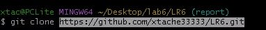
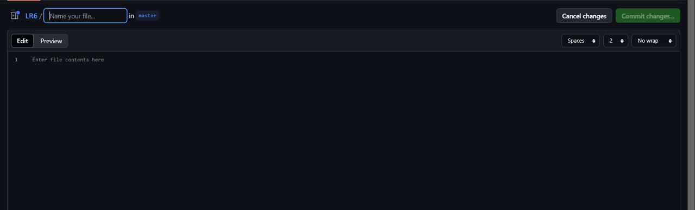
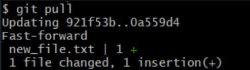
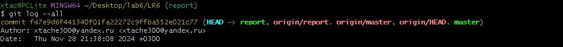
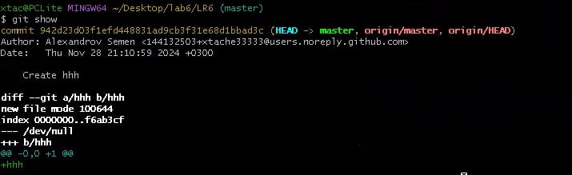
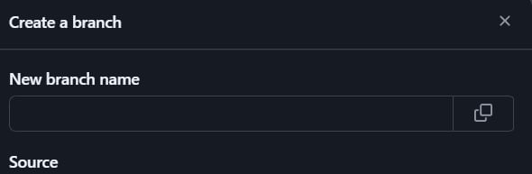
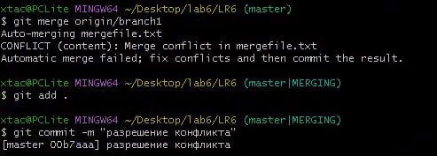
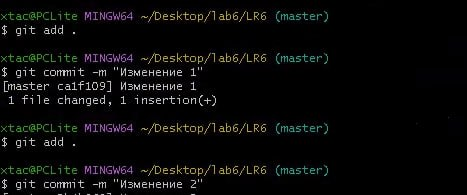
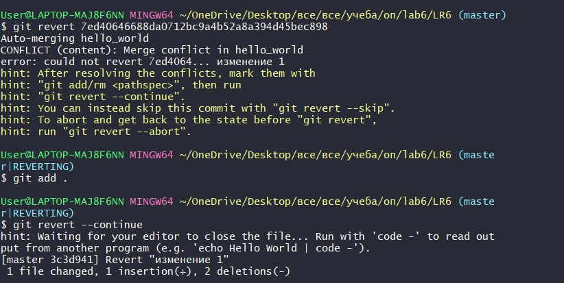

# LR6
Лабораторная работа №6

# Отчет по работе с Git

## 1. Создание форка
Сделана копия в личное хранилище из https://github.com/xtache33333/LR6.git

## 2. Настройка клиента git
Команда для изменения имени пользователя:

```bash
$ git config --global user.name "4318 Александров С.С."
```
Команда для изменения почты пользователя:

```bash
$ git config --global user.email "xtache300@yandex.ru"
```
*Результаты изменения имени и почты пользователя* 


## 3. Клонирование репозитория

```bash
$ git clone https://github.com/xtache33333/LR6.git
```
*Скриншот клонирования*  




## 4. Добавление нового файла
*Скриншот с добавлением нового файла*




## 5. Добавление изменений в локальный репозиторий

```bash
$ git pull
```
*Изменения данных в локальном репозитории*



## 6. Получение данных для каждой из веток

```bash
$ git log --all
```
*Результат работы команды*




## 7. Просмотр последних изменений

```bash
$ git show
```
*Результат работы команды*




## 8. Создание новой ветки

*Добавление ветки в гитхабе*




## 9. Слияние веток

```bash
$ git checkout master
$ git merge origin/branch1
```
*Выполнено слияние веток*




## 10. Удаление побочной ветки после слияния

```bash
$ git push origin --delete branch1
```
*Удалил побочную ветку*


## 11. Сделал несколько изменений, закоммитив их с комментариями

*Скриншот коммитов*




## 12. Откат коммита
Удаление последнего коммита с помощью команды:

```bash
$ git revert <HASH_ID>
```
*Скриншот отката*




## 13. Получение истории операций в форматированном виде

```bash
$ git log --pretty=format:"%h %ad %an %s" --date=short
```

## 14. История операций
```
ea77e5c | 2024-11-28 | xtache300@yandex.ru | загрузил изображения
f47e9d6 | 2024-11-28 | xtache300@yandex.ru | Revert "Изменение 1"
5b4b969 | 2024-11-28 | xtache300@yandex.ru | Изменение 2
ca1f109 | 2024-11-28 | xtache300@yandex.ru | Изменение 1
00b7aaa | 2024-11-28 | xtache300@yandex.ru | разрешение конфликта
942d23d | 2024-11-28 | Alexandrov Semen | Create hhh
921f53b | 2020-11-21 | Kurtyanik | Обновление информации
0f9f50d | 2020-11-21 | Kurtyanik | Заполнил файл
c08a654 | 2020-11-21 | Kurtyanik | Файл создан пустым
3c6e913 | 2020-11-21 | Kurtyanik | Initial commit
```

## 15. Вывод
В ходе выполнения работы я повторил базовые возможности системы управления версиями, получил опыт работы с Git Api, опыт работы с локальным и удаленным репозиторием.
